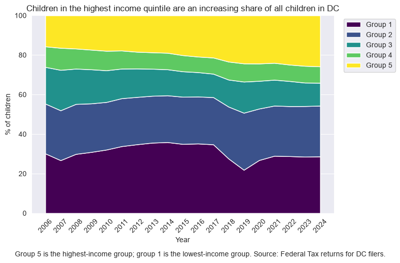
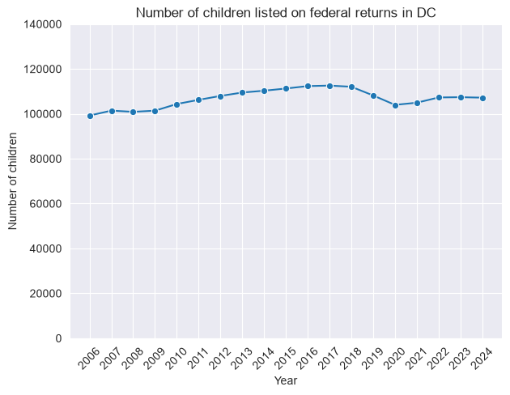

```{=html}
<style>
  body { font-size: 18px; }
  p { font-size: 18px; }
</style>
```

```{r setup, echo = T, warning=F, message=F}
knitr::opts_chunk$set(echo = T, 
                      warning=F, message=F,
                      out.width = "100%")

library(dplyr)
library(ggplot2)
library(tidyr)
library(readr)
library(stringr)
library(RColorBrewer)
library(sf)
library(tidycensus) 
library(purrr) 
library(patchwork)
library(plotly)
library(readxl)
library(srvyr)


source("api_keys.R")

setwd("~/GitHub/youth-stats")
ms=1.1
total_col="steelblue"; black_col="#8d5524"; white_col="#ffdbac"
hispa_col="#e0ac69"; other_col="#702963"

fmt <- function(num) {
  format(round(num), big.mark=",")
}
```

<br>

Many U.S. cities have seen their youth-age populations decline. See [this WSJ piece](https://www.wsj.com/us-news/cities-losing-families-children-a860a9b1?st=w78QhH&reflink=desktopwebshare_permalink), for example.

DC is a partial exception: its child population grew over the 2010s, though that mostly returned it to where it stood in 2000.

This page looks at why that might be.

# How many kids live in DC?

The chart below shows DC's youth population between 1990 and 2025. After falling between 1995 and 2010, the number has ticked up again, with a COVID-induced dip recently as some families sought out more space in the suburbs.
^[District of Columbia Population Statistics (2025). KIDS COUNT Data Center. Aecfkidscount; Annie E. Casey Foundation. https://datacenter.aecf.org/data/tables/102-child-population-by-gender]
^[Methodological note: This page uses populations figures from several different sources, including the American Community Survey, the Decennial Census, and tax returns. Each of these sources shows slightly different population totals. The Decennial Census under-counted children in 2020, for example, but the Census' population estimates try to adjust for this by referencing administrative data. The KidsCount figures shown in this first chart are based on Census population estimates, which run about 10,000 above the 2020 Census count used elsewhere on this page.]

<br>

```{r}
cpop <- read_excel("data/Child population by gender.xlsx") %>%
  filter(Gender == "Total less than 18", DataFormat=="Number") %>%
  mutate(count = as.numeric(Data), year=as.numeric(TimeFrame))

a <- ggplot(cpop, aes(x=year, y=as.numeric(count))) +
  geom_line(linewidth = ms) +
   scale_y_continuous(
      labels = scales::label_comma()
    , limits = c(0, 140e3)
    ) +
  labs(x="", y="Number of Children", 
       caption="Source: KidsCount / The Annie E. Casey Foundation, U.S. Census Bureau",
       title = "Under 18 population"
         ) +
  theme(
     plot.caption = element_text(hjust = 0)
    # , panel.grid = element_blank()
    )

tpop <- read_excel("data/Total population by child and adult populations.xlsx") %>%
  filter(DataFormat=="Number",  `Child and Adult Populations`=="Total Population") %>%
  mutate(count = as.numeric(Data), year=as.numeric(TimeFrame))

b <- ggplot(tpop, aes(x=year, y=as.numeric(count))) +
  geom_line(linewidth = ms) +
   scale_y_continuous(
      labels = scales::label_comma()
    , limits = c(0, NA)
    ) +
  labs(x="", y="Number of Total Residents", 
       title = "Total population"
         ) +
  theme(
     plot.caption = element_text(hjust = 0)
    # , panel.grid = element_blank()
    )

a + b
```

<br>

If we look farther back in time, we can see that DC's youth population used to be much higher, both in absolute and percentage terms. The percentage of children has continued to fall, even as the absolute number has risen, because DC's overall population has been increasing.
^[Azimeraw, M., & Phillips, J. (2010). District Population Trends 1800 to 2009. District of Columbia State Data Center Monthly Brief. https://planning.dc.gov/sites/default/files/dc/sites/op/publication/attachments/DCOP_SDC_June%25202010%2520Briefing%2520Report.pdf I supplement this time series with 2025 data from KidsCount: https://datacenter.aecf.org/data/tables/99-total-population-by-child-and-adult-populations?loc=10] 

<br>

```{r}
df <- read_excel("data/OP_pop_data.xlsx")

a <- 
  ggplot(df, aes(x=year, y=u15_pop)) +
  geom_line(linewidth = ms) +
  scale_y_continuous(labels = scales::label_comma(), limits = c(0, 200e3)) +
  scale_x_continuous(n.breaks = 10) +
  theme_minimal() +
    theme(
     plot.caption = element_text(hjust = 0)
    # , panel.grid = element_blank()
    ) +
  labs(x="", y="Under 15 population")

b <- 
  ggplot(df, aes(x=year, y=u15_pct)) +
  geom_line(linewidth = ms) +
  scale_y_continuous(labels = scales::label_percent(), limits=c(0, .3)) +
  scale_x_continuous(n.breaks = 10) +
  theme_minimal() +
    theme(
     plot.caption = element_text(hjust = 0)
    # , panel.grid = element_blank()
    ) +
  labs(x="", y="Under 15 population, as % of total pop.")

a + b + plot_annotation(
  title = "DC's youth population used to be much higher",
  caption = 'Source: DC Office of Planning, U.S. Census Bureau, KidsCount / The Annie E. Casey Foundation',
  theme = theme(plot.caption = element_text(hjust = 0))
  )
```

```{r}

xwalk <- tibble::tribble(
  ~city,            ~state, ~county,
  "New York",       "NY",  "Bronx County",
  "New York",       "NY",  "Kings County",
  "New York",       "NY",  "New York County",
  "New York",       "NY",  "Queens County",
  "New York",       "NY",  "Richmond County",
  "Los Angeles",    "CA",  "Los Angeles County",
  "Chicago",        "IL",  "Cook County",
  "Houston",        "TX",  "Harris County",
  "Phoenix",        "AZ",  "Maricopa County",
  "Philadelphia",   "PA",  "Philadelphia County",
  "San Antonio",    "TX",  "Bexar County",
  "San Diego",      "CA",  "San Diego County",
  "Dallas",         "TX",  "Dallas County",
  "Jacksonville",   "FL",  "Duval County",
  "Austin",         "TX",  "Travis County",
  "Fort Worth",     "TX",  "Tarrant County",
  "San Jose",       "CA",  "Santa Clara County",
  "Columbus",       "OH",  "Franklin County",
  "Charlotte",      "NC",  "Mecklenburg County",
  "Indianapolis",   "IN",  "Marion County",
  "San Francisco",  "CA",  "San Francisco County",
  "Seattle",        "WA",  "King County",
  "Denver",         "CO",  "Denver County",
  "Oklahoma City",  "OK",  "Oklahoma County",
  "Nashville",      "TN",  "Davidson County",
  "Washington",     "DC",  "District of Columbia",
  "El Paso",        "TX",  "El Paso County",
  "Las Vegas",      "NV",  "Clark County",
  "Boston",         "MA",  "Suffolk County",
  "Detroit",        "MI",  "Wayne County",
  "Portland",       "OR",  "Multnomah County",
  "Louisville",     "KY",  "Jefferson County",
  "Memphis",        "TN",  "Shelby County",
  "Baltimore",      "MD",  "Baltimore city",
  "Milwaukee",      "WI",  "Milwaukee County",
  "Albuquerque",    "NM",  "Bernalillo County",
  "Tucson",         "AZ",  "Pima County",
  "Fresno",         "CA",  "Fresno County",
  "Sacramento",     "CA",  "Sacramento County") |>
  left_join(distinct(transmute(fips_codes, state, county,
                               GEOID = paste0(state_code, county_code))),
            by = c("state", "county"))

stopifnot(!any(is.na(xwalk$GEOID)))   # catches any name I got wrong

pull_youth_data <- function(year) {
  cells <- c(3:6, 27:30)   # P012: male/female under 5, 5-9, 10-14, 15-17
  vars  <- c(total = "P012001",
             setNames(sprintf("P012%03d", cells), paste0("c", cells)))

  tidycensus::get_decennial("county", variables = vars, year = year,
                            sumfile = "sf1", output = "wide", key = CENSUS_KEY) |>
    semi_join(xwalk, by = "GEOID") |>
    transmute(GEOID, NAME, year = year,
              race = "Total, all races",
              population = total,
              children = rowSums(across(starts_with("c"))),
              share_children = children / population)
}

pull_dc_race_data <- function(year) {
  cells <- c(3:6, 27:30)   # P012: male/female under 5, 5-9, 10-14, 15-17
  iters <- c(B = "Black alone",
             H = "Hispanic or Latino",
             I = "White alone, not Hispanic")

  vars <- unlist(lapply(names(iters), \(s)
            setNames(sprintf("P012%s%03d", s, cells), paste0(s, "_", cells))))

  tidycensus::get_decennial("county", variables = vars, year = year,
                            sumfile = "sf1", state = "DC", key = CENSUS_KEY) |>
    mutate(race = unname(iters[sub("_.*", "", variable)])) |>   # "B_3" → "Black alone"
    group_by(GEOID, NAME, race) |>
    summarise(children = sum(value), .groups = "drop") |>
    mutate(year = year)
}

k2000 <- bind_rows(pull_youth_data(2000), pull_dc_race_data(2000))
k2010 <- bind_rows(pull_youth_data(2010), pull_dc_race_data(2010))


pull_youth_2020_data <- function() {
  readr::read_csv(
    "https://www2.census.gov/programs-surveys/popest/datasets/2020-2024/counties/asrh/cc-est2024-agesex-all.csv",
    col_types = readr::cols(.default = "c"),
    locale = readr::locale(encoding = "latin1")) |>
    filter(YEAR == "2") |>                                   # July 1, 2020
    mutate(GEOID = paste0(STATE, COUNTY)) |>
    semi_join(xwalk, by = "GEOID") |>
    transmute(GEOID,
              NAME  = paste0(CTYNAME, ", ", STNAME),
              year  = 2020,
              race  = "Total, all races",
              population = as.numeric(POPESTIMATE),
              children   = population - as.numeric(AGE18PLUS_TOT),
              share_children = children / population)
}

pull_dc_race_2020_data <- function() {
  readr::read_csv(
    "https://www2.census.gov/programs-surveys/popest/datasets/2020-2024/state/asrh/sc-est2024-alldata6.csv",
    col_types = readr::cols(.default = "c")) |>
    filter(STATE == "11", SEX == "0") |>                     # DC, both sexes
    mutate(across(c(ORIGIN, RACE, AGE), as.integer),
           pop = as.numeric(POPESTIMATE2020)) |>             # July 1, 2020
    filter(AGE < 18) |>
    summarise(
      `Black alone`               = sum(pop[ORIGIN == 0 & RACE == 2]),
      `Hispanic or Latino`        = sum(pop[ORIGIN == 2]),
      `White alone, not Hispanic` = sum(pop[ORIGIN == 1 & RACE == 1])) |>
    tidyr::pivot_longer(everything(), names_to = "race", values_to = "children") |>
    mutate(GEOID = "11001",
           NAME  = "District of Columbia, District of Columbia",
           year  = 2020)
}

k2020 <- bind_rows(pull_youth_2020_data(), pull_dc_race_2020_data())

all_counties <- bind_rows(k2000, k2010, k2020)


out_c <- all_counties |>
  inner_join(xwalk, by = "GEOID") |>
  arrange(city, year, race)

dc_pop <- out_c |> filter(race == "Total, all races", year == 2020, GEOID == "11001") |> pull(population)
```

<br>

Relative to other U.S. urban counties, DC has relatively few children as a share of its population.

<br>

```{r}
out_c %>% filter(race == "Total, all races", year==2020) %>%
  group_by(city) %>%
  summarise(
      children=sum(children, na.rm=T)
    , population=sum(population, na.rm=T)
    , share_children = children / population
    , .groups='drop') %>%
  mutate(DC = if_else(city == "Washington", 1, 0)) %>%
  ggplot(aes(y=forcats::fct_reorder(city, share_children), x=share_children, fill=factor(DC))) +
  geom_bar(stat="identity") +
  labs(x="Children as share of population", y="") + 
  guides(fill="none") +
  scale_x_continuous(labels = scales::label_percent()) + 
  plot_annotation(
  title = "Compared to large-city counties, DC has relatively few children",
  caption = 'Chart shows county-level data for large U.S. cities in 2020, using Census Bureau Population Estimates.\nSource: Census Bureau Population Estimates (July 1, 2020).',
  theme = theme(plot.caption = element_text(hjust = 0))
  )
```

<br>

The line charts below show number of children in 2000, 2010, and 2020. The y-scales in the plots below are all slightly different, because the counties differ widely in size, but they all start at zero. Urban counties that saw increases in their child population in absolute terms between 2000 and 2020 are shown in green.

While some cities have had longer-term increases in the number of children, DC's increase has been more a return to the level previously seen around 2000.  

The totals below are decennial census counts, so they differ from the KidsCount figures above, which are based on Census Bureau population estimates.^[See methodological note above.] Those estimates correct for the 2020 census's undercount of young children and put DC's 2020 child population at about 126,000, roughly 10% above 2000. But earlier censuses also undercounted young children and weren't adjusted, so the chart below uses census counts for every year to keep the timeseries consistent.

**Takeaway: the District's 2010-2020 increase in child population looks less dramatic when compared to additional years of historical data (e.g. 2000). By census counts, the 2020 youth population was actually slightly below the 2000 youth population.**

<br>

```{r, fig.height=6}

pull_youth_dhc_2020 <- function() {
  cells <- c(3:6, 27:30)   # P12: male/female under 5, 5-9, 10-14, 15-17
  vars  <- c(total = "P12_001N",
             setNames(sprintf("P12_%03dN", cells), paste0("c", cells)))

  tidycensus::get_decennial("county", variables = vars, year = 2020,
                            sumfile = "dhc", output = "wide", key = CENSUS_KEY) |>
    semi_join(xwalk, by = "GEOID") |>
    transmute(GEOID, NAME, year = 2020, race = "Total, all races",
              population = total,
              children = rowSums(across(starts_with("c"))),
              share_children = children / population)
}

trend_c <- bind_rows(pull_youth_data(2000), pull_youth_data(2010), pull_youth_dhc_2020()) |>
  inner_join(xwalk, by = "GEOID")


trend_c %>% filter(race == "Total, all races") %>%
  group_by(year, city) %>% summarise(children = sum(children, na.rm=T), .groups='drop') %>%
  group_by(city) %>%
  mutate(rise = if_else(children[year==2000] < children[year==2020], 1, 0)) %>% ungroup() %>%
  # mutate(rise = if_else(city == "Washington", 2, rise)) %>%
  ggplot(aes(x=year, y=children, color=factor(rise))) +
  geom_line() +
  guides(color="none") +
  scale_x_continuous(n.breaks = 3) +
  scale_color_manual(values = c("#FF3F00", "#70B77E")) +
  theme(
    panel.grid = element_blank(),
    axis.title.y = element_blank(), # Removes the main Y-axis title
    axis.text.y  = element_blank(), # Removes the tick labels (numbers)
    axis.ticks.y = element_blank(), # Removes the small tick marks
    
    axis.ticks.x = element_blank(),  # Removes the small tick marks
    axis.text.x  = element_blank()  # Removes the tick labels (numbers)
  ) +
  scale_y_continuous(limits = c(0, NA), expand = expansion(mult = c(0, 0.05)) ) +
  facet_wrap(~forcats::fct_reorder(city, rise)
             , scales="free_y"
             ) +
  ggtitle("DC's child population is back to about where it was in 2000") +
  labs(x="", y="Number of children", caption="Source: U.S. Census Bureau, Decennial Census.") +
  theme(plot.caption = element_text(hjust = 0))
```

```{r}
# =========================================================================
# 1. 2020 CENSUS DATA (DHC File)
# =========================================================================
vars_2020 <- c(
  # Males (Ages 0 to 18)
  "M0" = "PCT12_003N", "M1" = "PCT12_004N", "M2" = "PCT12_005N", "M3" = "PCT12_006N", 
  "M4" = "PCT12_007N", "M5" = "PCT12_008N", "M6" = "PCT12_009N", "M7" = "PCT12_010N", 
  "M8" = "PCT12_011N", "M9" = "PCT12_012N", "M10" = "PCT12_013N", "M11" = "PCT12_014N", 
  "M12" = "PCT12_015N", "M13" = "PCT12_016N", "M14" = "PCT12_017N", "M15" = "PCT12_018N", 
  "M16" = "PCT12_019N", "M17" = "PCT12_020N", "M18" = "PCT12_021N",
  # Females (Ages 0 to 18)
  "F0" = "PCT12_107N", "F1" = "PCT12_108N", "F2" = "PCT12_109N", "F3" = "PCT12_110N", 
  "F4" = "PCT12_111N", "F5" = "PCT12_112N", "F6" = "PCT12_113N", "F7" = "PCT12_114N", 
  "F8" = "PCT12_115N", "F9" = "PCT12_116N", "F10" = "PCT12_117N", "F11" = "PCT12_118N", 
  "F12" = "PCT12_119N", "F13" = "PCT12_120N", "F14" = "PCT12_121N", "F15" = "PCT12_122N", 
  "F16" = "PCT12_123N", "F17" = "PCT12_124N", "F18" = "PCT12_125N"
)

dc_2020_raw <- get_decennial(
  geography = "state", state = "DC", key=CENSUS_KEY,
  variables = vars_2020, year = 2020, sumfile = "dhc"
)

dc_2020_binned <- dc_2020_raw %>%
  mutate(age = as.numeric(str_remove(variable, "^[MF]"))) %>%
  mutate(age_group = case_when(
    age < 3  ~ "under 3",         age < 5  ~ "3 but under 5",
    age < 7  ~ "5 but under 7",   age < 9  ~ "7 but under 9",
    age < 11 ~ "9 but under 11",  age < 13 ~ "11 but under 13",
    age < 15 ~ "13 but under 15", age < 17 ~ "15 but under 17",
    age < 19 ~ "17 and under 19"
  )) %>%
  group_by(age_group) %>%
  summarise(pop_2020 = sum(value))

# =========================================================================
# 2. 2010 CENSUS DATA (SF1 File)
# =========================================================================
vars_2010 <- c(
  # Males (Ages 0 to 18)
  "M0" = "P014003", "M1" = "P014004", "M2" = "P014005", "M3" = "P014006", 
  "M4" = "P014007", "M5" = "P014008", "M6" = "P014009", "M7" = "P014010", 
  "M8" = "P014011", "M9" = "P014012", "M10" = "P014013", "M11" = "P014014", 
  "M12" = "P014015", "M13" = "P014016", "M14" = "P014017", "M15" = "P014018", 
  "M16" = "P014019", "M17" = "P014020", "M18" = "P014021",
  # Females (Ages 0 to 18)
  "F0" = "P014024", "F1" = "P014025", "F2" = "P014026", "F3" = "P014027", 
  "F4" = "P014028", "F5" = "P014029", "F6" = "P014030", "F7" = "P014031", 
  "F8" = "P014032", "F9" = "P014033", "F10" = "P014034", "F11" = "P014035", 
  "F12" = "P014036", "F13" = "P014037", "F14" = "P014038", "F15" = "P014039", 
  "F16" = "P014040", "F17" = "P014041", "F18" = "P014042"
)

dc_2010_raw <- get_decennial(
  geography = "state", state = "DC", key=CENSUS_KEY,
  variables = vars_2010, year = 2010, sumfile = "sf1"
)

dc_2010_binned <- dc_2010_raw %>%
  mutate(age = as.numeric(str_remove(variable, "^[MF]"))) %>%
  mutate(age_group = case_when(
    age < 3  ~ "under 3",         age < 5  ~ "3 but under 5",
    age < 7  ~ "5 but under 7",   age < 9  ~ "7 but under 9",
    age < 11 ~ "9 but under 11",  age < 13 ~ "11 but under 13",
    age < 15 ~ "13 but under 15", age < 17 ~ "15 but under 17",
    age < 19 ~ "17 and under 19"
  )) %>%
  group_by(age_group) %>%
  summarise(pop_2010 = sum(value))

# =========================================================================
# 3. 2000 CENSUS DATA (SF1 File)
# =========================================================================
vars_2000 <- c(
  # Males (Ages 0 to 18)
  "M0" = "PCT012003", "M1" = "PCT012004", "M2" = "PCT012005", "M3" = "PCT012006", 
  "M4" = "PCT012007", "M5" = "PCT012008", "M6" = "PCT012009", "M7" = "PCT012010", 
  "M8" = "PCT012011", "M9" = "PCT012012", "M10" = "PCT012013", "M11" = "PCT012014", 
  "M12" = "PCT012015", "M13" = "PCT012016", "M14" = "PCT012017", "M15" = "PCT012018", 
  "M16" = "PCT012019", "M17" = "PCT012020", "M18" = "PCT012021",
  # Females (Ages 0 to 18)
  "F0" = "PCT012107", "F1" = "PCT012108", "F2" = "PCT012109", "F3" = "PCT012110", 
  "F4" = "PCT012111", "F5" = "PCT012112", "F6" = "PCT012113", "F7" = "PCT012114", 
  "F8" = "PCT012115", "F9" = "PCT012116", "F10" = "PCT012117", "F11" = "PCT012118", 
  "F12" = "PCT012119", "F13" = "PCT012120", "F14" = "PCT012121", "F15" = "PCT012122", 
  "F16" = "PCT012123", "F17" = "PCT012124", "F18" = "PCT012125"
)

dc_2000_raw <- get_decennial(
  geography = "state", state = "DC", key=CENSUS_KEY,
  variables = vars_2000, year = 2000, sumfile = "sf1"
)

dc_2000_binned <- dc_2000_raw %>%
  mutate(age = as.numeric(str_remove(variable, "^[MF]"))) %>%
  mutate(age_group = case_when(
    age < 3  ~ "under 3",         age < 5  ~ "3 but under 5",
    age < 7  ~ "5 but under 7",   age < 9  ~ "7 but under 9",
    age < 11 ~ "9 but under 11",  age < 13 ~ "11 but under 13",
    age < 15 ~ "13 but under 15", age < 17 ~ "15 but under 17",
    age < 19 ~ "17 and under 19"
  )) %>%
  group_by(age_group) %>%
  summarise(pop_2000 = sum(value))

# =========================================================================
# 4. COMBINE AND SORT ALL YEARS
# =========================================================================
dc_final_trends <- dc_2000_binned %>%
  full_join(dc_2010_binned, by = "age_group") %>%
  full_join(dc_2020_binned, by = "age_group") %>%
  mutate(age_group = factor(age_group, levels = c(
    "under 3", "3 but under 5", "5 but under 7", "7 but under 9", 
    "9 but under 11", "11 but under 13", "13 but under 15", 
    "15 but under 17", "17 and under 19"
  ))) %>%
  filter(age_group != "17 and under 19") %>%
  arrange(age_group) %>%
  mutate(
      pct_2000 = pop_2000 / sum(pop_2000)
    , pct_2010 = pop_2010 / sum(pop_2010)
    , pct_2020 = pop_2020 / sum(pop_2020)
    , change_pct_2000_2020 = pct_2020 - pct_2000
    , raw_change = pop_2020 - pop_2000
    )
```

<br>

The table below shows population trends by age group. The population of very young children has grown, while other age groups' populations have declined somewhat (although 2020 may have been an especially low year). The overall change from 2000 to 2020 was +`r fmt(sum(dc_final_trends$raw_change))`. 

Again, these totals differ somewhat from the numbers in the charts in the next section, which are taken from analysis by the University of Wisconsin's [Applied Population Laboratory](https://netmigration.wisc.edu/). The APL totals better account for Census child under-counts. Specifically, APL adjusts the 2010 starting population using national Census under-count rates, and the 2020 ending population uses the Census Bureau's 2020 Estimates Base, which incorporates administrative data. As a result, APL's 2010 child population (ages 0–14) is about 1,600 higher than the Census count, and its 2020 figure is about 10,500 higher.

**Takeaway: the increase in DC's youth population was concentrated among young children.**

<br>

```{r}
dc_final_trends %>%
  select(-starts_with("pct_"), -change_pct_2000_2020) %>%
  rename(  `Age group` = age_group
         , `2000 population` = pop_2000
         , `2010 population` = pop_2010
         , `2020 population` = pop_2020
         , `'00 - '20 change` = raw_change
         ) %>%
  knitr::kable(digits = 0, format.args = list(big.mark = ","))
```
 
 <br><br>
 
# Why did DC's youth-age population increase during the 2010s?

```{r}
# Source: https://netmigration.wisc.edu/

# Single file, all three decades. Prefixes: 9 = 1990s, 0 = 2000s, 1 = 2010s.
df <- read.csv("data/netmigration_1788187402525/netmigration_1788187402525.csv"
               , colClasses = c(fips = "character"))
names(df) <- trimws(names(df))          # last header field can carry a stray \r

ages    <- c(0, 5, 10, 15, 20, 25, 30, 35, 40, 45, 50, 55, 60, 65, 70, 75)
periods <- c("9" = "1990s", "0" = "2000s", "1" = "2010s")

# The first letter indicates what type of data the variable holds: 
# “e” – expected population at end of decade, absent net migration. 
# “m” – net migrants (NM= final observed population – expected population) 
# “r” – net migration rate (NMR= net migrants/expected population*100). If expected population is 
# zero, then NMR is missing. Expressed as per 100 individuals.
stopifnot(all(paste0(rep(c("e","m","r"), each = 3 * length(ages)),
                     rep(names(periods), each = length(ages)),
                     "ttt", ages) %in% names(df)))

# ---- 1. Decomposition of change in the ages 0-14 population in DC -------------
# e/m are indexed by age at the end of the decade.
#   e[0], e[5]   surviving births during the decade
#   e[10]        start-of-decade 0-4 cohort, still 0-14 at the end
#   e[15], e[20] start-of-decade 5-14 cohort, now aged out of 0-14
# ttt means "total total total" as opposed to say, ttf, which would mean
# total total female, for example
# p is the period/decade
decomp <- function(row, p) {
  e <- setNames(as.numeric(row[paste0("e", p, "ttt", ages)]), ages)
  m <- setNames(as.numeric(row[paste0("m", p, "ttt", ages)]), ages)
  births  <- unname(e["0"] + e["5"])
  retain  <- unname(e["10"])
  agedout <- unname(e["15"] + e["20"])
  netmig  <- unname(m["0"] + m["5"] + m["10"])
  p_end   <- sum(e[c("0","5","10")] + m[c("0","5","10")])
  change  <- p_end - (retain + agedout)
  stopifnot(abs(change - (births - agedout + netmig)) < 1)
  tibble(births = births, agedout = -agedout, netmig = netmig, change = change)
}

decompose_county <- function(df, county_fips) {
  row <- filter(df, fips == county_fips)
  stopifnot(nrow(row) == 1)
  bind_rows(lapply(names(periods),
                   function(p) mutate(decomp(row, p), decade = periods[[p]])))
}

tab <- decompose_county(df, "11001")  # this is the fips for DC
# print(tab)

comp_levels <- c(births = "Births", agedout = "Aged out",
                 netmig = "Net migration", change = "Net change")

births_increase <- tab$births[tab$decade=="2010s"] - tab$births[tab$decade=="2000s"]
ageout_increase <- tab$agedout[tab$decade=="2010s"] - tab$agedout[tab$decade=="2000s"]
migrat_increase <- tab$netmig[tab$decade=="2010s"] - tab$netmig[tab$decade=="2000s"]

percent_increases <-
  round(100*c(births_increase, ageout_increase, migrat_increase) / 
sum(births_increase, ageout_increase, migrat_increase))
```

The University of Wisconsin's [Applied Population Laboratory](https://netmigration.wisc.edu/) breaks out county & state-level population changes in each decade by age group. We use their analysis for DC's population ages 0 to 14. APL also decomposes those changes into component parts:

1. Births: Children born in DC during the decade who survived to its end. This obviously increases DC's youth population, all else equal.
2. Migration: In-migration increases DC's youth population; out-migration decreases the population. Net migration is the sum of in- and out-migration.
3. Age-outs: This is the number of children who turned 15 during the decade (APL reports five-year age groups, so 0–14 is the last age bracket that does not include adults. The next group up, 15–19, mixes children with college-age adults). A child who was 11 in 2010, for example, would be 21 by 2020.

The chart below shows how each of these elements added or subtracted from DC's population between 2010 and 2020. Overall, child net migration was negative 
(-`r fmt(100*round(abs(tab$netmig[tab$decade=="2010s"])/100))`). 
The age-out term will always be negative; roughly `r fmt(100*round(abs(tab$agedout[tab$decade=="2010s"])/100))` people who were children in 2010 were 15 or older by 2020. But these subtractions were outweighed by births
(+`r fmt(100*round(abs(tab$births[tab$decade=="2010s"])/100))`), so the total youth population was roughly 
`r fmt(100*round(abs(tab$change[tab$decade=="2010s"])/100))` higher by the end of the decade.


```{r}
library(waterfalls)
to_plot20 <- tab %>% filter(decade=="2010s") %>% tidyr::pivot_longer(-decade) %>% 
  select(-decade) %>% filter(name!= 'change')

to_plot10 <- tab %>% filter(decade=="2000s") %>% tidyr::pivot_longer(-decade) %>% 
  select(-decade) %>% filter(name!= 'change')

a <- waterfalls::waterfall(values = round(to_plot20$value)
                      , labels = c("Births", "Aged out", "Net migration")
                      , calc_total = T) +
  labs(x="", y="Number of children", 
       caption="Source: U.S. Census Bureau, University of Wisconsin Applied Population Laboratory",
       title = "Despite net negative migration,\nDC's youth population grew between 2010 & 2020") +
  theme_minimal() +
  theme(plot.caption = element_text(hjust = 0)) +
  scale_y_continuous(labels = scales::label_comma(accuracy = 1)) 
  
# b <- waterfalls::waterfall(values = round(to_plot10$value)
#                       , labels = to_plot10$name
#                       , calc_total = T) +
#   labs(x="", y="Number of children", 
#        caption="Source: U.S. Census Bureau, University of Wisconsin Applied Population Laboratory",
#        title = "Despite net negative migration,\nDC's youth population grew between 2010 & 2020") +
#   theme_minimal() +
#   theme(
#       plot.title = element_text(size = 16, face = 'bold')
#     , plot.caption = element_text(hjust = 0)
#     ) +
#   scale_y_continuous(labels = scales::label_comma(accuracy = 1))

a 
```

<br><br><br>

The sections below unpack each of these three contributions to the District's 2010s youth population increase.

<br>

## Births

DC's overall population was increasing during the 2010s. All else equal, adult population increases will lead to youth population increases, because some of those additional adults will have children. 
Indeed, births in DC increased during the 2010s, relative to the 2000s.^[National Center for Family & Marriage Research (2026). County-, state-, and national-level birth counts and fertility rates, United States, 1982–2024. Marriage, Divorce, & Birth Data Compass. Bowling Green State University. Retrieved from https://www.bgsu.edu/ncfmr/resources/data/original-data/county-level-birth-data-1982-2024] ^[See also <https://edscape.dc.gov/page/pop-and-students-number-births-and-birth-rates>]
Note however, that the number of births during the 1990s was actually comparable to the number during the 2010s: `r fmt(tab$births[tab$decade=="1990s"])` versus `r fmt(tab$births[tab$decade=="2010s"])`, respectively. So in one sense, 2010s births were more of a return to 1990s levels than a novel increase (although as discussed below, the demographics of the 2010s increase are different).

```{r}
# Data from here:
  # https://www.bgsu.edu/ncfmr/resources/data/original-data/county-level-birth-data-1982-2024
fert <- read_excel("data/ncfmr-dc-cntyyr-st-ntl-long-births-rates-1982-2024.xlsx")

fert <- dplyr::inner_join(
    out_c %>% select(GEOID, NAME, city) %>% distinct()
  , fert, by = c("GEOID"="geoid"))

dc_b <- fert %>% filter(city == "Washington") %>% arrange(year)
pct_change <- with(dc_b, births[year == 2024] / births[year == 2000] - 1)


ggplot(fert %>% filter(city=="Washington")
       , aes(x=year, y=births)) +
  geom_line(linewidth=ms) +
  labs(x="", y="Births in DC", 
       title=paste0("DC Births rose during 2010s; ", ifelse(pct_change >= 0, "up ", "down "),
                    abs(round(pct_change * 100)), "% since 2000"),
       caption="Source: National Center for Family & Marriage Research, Bowling Green State University"
       ) +
  theme_minimal() +
  theme(plot.caption = element_text(hjust = 0)) +
  scale_y_continuous(labels = scales::label_comma(accuracy = 1),
                     limits = c(0, NA))

```

Part of the 2010s increase in births during the 2010s can be traced to a specific driver: net in-migration of people in their 30s increased significantly in DC during the decade. There were more people living in DC at the age when many people start families. The line chart in the net-migration section below shows how net migration changed across all age groups over the decades in DC. Note the upward jumps in the 25-39 groups. 


There was also a significant drop in infant mortality in DC between the 2000s and 2020. According to the DC Department of Health, there were roughly 8 deaths per 1,000 live births in DC in the early 2010s; this fell to 5.5 deaths per 1,000 live births in the 2019-2023 period.^[Mayor Vincent C. Gray and DC Department of Health announce historic decrease in district’s infant mortality rate. (2016). DC.Gov. https://dchealth.dc.gov/es/release/mayor-vincent-c-gray-and-dc-department-health-announce-historic-decrease-district%E2%80%99s-infant-0] ^[DC health highlights progress in maternal and infant health in perinatal health report | doh. (2016). DC.Gov. https://dchealth.dc.gov/release/dc-health-highlights-progress-maternal-and-infant-health-perinatal-health-report] 
While this is a huge improvement (and literally a matter of life and death!) it accounts for a relatively small share of DC's total population increase during the 2010s. 
A drop in infant mortality of 2.5 deaths per 1,000 live births represents roughly `r fmt(to_plot20$value[to_plot20$name=="births"]/1000 * 2.5)` additional births, using the 2010s-era `r fmt(to_plot20$value[to_plot20$name=="births"])` births as a baseline. That's about 
`r round(to_plot20$value[to_plot20$name=="births"]/1000 * 2.5 / to_plot20$value[to_plot20$name=="births"] * 100, 2)`% of all births during that period.
So while this drop in infant mortality is obviously a good thing, it is not a major driver of DC's 2010's population increase.

It is also worth noting that the rise in births wasn't due to an increase in the fertility rate (i.e. the likelihood that a given person decides to have children). DC's fertility rate has fallen almost every year since the mid-2000s, which itself represented a decline from the early 1990s.
Demographers calculate the "general fertility rate" by dividing the number of births by the female population ages 15 to 44, and multiplying by 1,000.^[<https://www.ncbi.nlm.nih.gov/books/NBK215693/>] The chart below shows DC's GFR over time. This has steadily fallen.


```{r}
ggplot(fert %>% filter(city=="Washington")
       , aes(x=year, y=gfr)) +
  geom_line(linewidth=ms) +
  scale_y_continuous(limits = c(0, 75)) +
  labs(x="", y="General Fertility Rate", 
       title="DC's General Fertility Rate has fallen over time"
       , caption="Source: National Center for Family & Marriage Research, Bowling Green State University"
       ) +
  theme_minimal() +
  theme(plot.caption = element_text(hjust = 0)) +
  scale_y_continuous(labels = scales::label_comma(accuracy = 1),
                     limits = c(0, NA))
```

DC's GFR is also on the lower end among large U.S. cities (which themselves have mostly seen steady declines in GFR; see appendix).


```{r}
fert %>% filter(year==2024) %>%
  group_by(city, year) %>%
  summarise(
      births=sum(births, na.rm=T)
    , age1544_fem=sum(age1544_fem, na.rm=T)
    , gfr = births / age1544_fem
    , .groups='drop'
    ) %>%
  mutate(DC = if_else(city == "Washington", 1, 0)) %>%
  ggplot(aes(y=forcats::fct_reorder(city, gfr), x=gfr*1000, fill=factor(DC))) +
  geom_bar(stat="identity") +
  labs(x="GFR in 2024 (births/1000 women 15-44)", y="",
       title="DC's GFR is lower than in many urban counties") + 
  guides(fill="none") +
  theme_minimal() +
  theme(plot.caption = element_text(hjust = 0)) 
```


**Takeaway: the District's increasing number of births was not due to higher fertility rates, nor, to any significant extent, falling infant mortality. It was mostly driven by population increases among adults near peak family-starting ages. That increase, in turn, was driven by increased net migration: more adults moving to DC during the 2010s, and fewer adults leaving. The increase in births looks less dramatic when comparing to the 1990s instead of the 2000s.**


## Net migration

As shown in the line chart below, the 2010s saw less negative youth net migration, though it was still negative for all under-15 groups. (Net migration for 20-somethings has been positive for the last three decades, as young adults attend university or start a first job). It is possible that some of the increase in net-migration among very young children is due to policies like universal pre-kindergarten; in analysis not shown here, we attempt to test this hypothesis, by comparing migration rates for very young children to migration rates for pre-teens, whose migration rates would theoretically be less impacted by the pre-k policy change. We do not observe a divergence in migration rates between the two groups, but the data are quite noisy, so it is difficult to draw any real conclusions from the data. 

**Takeaway: Net in-migration of youth has long been negative in DC, but it became less negative during the 2010s.**

```{r}
# ---- Net migration rate by age, all three decades ------------------
dc_rates <- bind_rows(lapply(names(periods), function(p) {
  tibble(age = ages, decade = periods[[p]],
         rate = as.numeric(df[df$fips == "11001", paste0("r", p, "ttt", ages)]))
})) %>%
  mutate(age = factor(paste0(age, "-", age + 4), paste0(ages, "-", ages + 4)))

ggplot(dc_rates, aes(age, rate, colour = decade, group = decade)) +
  geom_hline(yintercept = 0, colour = "grey60") +
  geom_line(linewidth = 1) + geom_point() +
  labs(title = "DC net migration rate by age",
       subtitle = "Ages 15-19 reflect college in-migration, not families",
       x = "Age at end of decade", y = "Net migrants per 100 expected") +
  theme_minimal() +
  theme(axis.text.x = element_text(angle = 45, hjust = 1))
```


## Children "aging out" of childhood

If you refer back to the first chart in this report, you will notice that 2010 marked the lowest point in DC's youth population in the last 35 years (and also, as the second set of charts show, in the last ~85 years). In other words, there were not that many children, relatively speaking, living in DC in 2010. This means that any increase in the child population after 2010 would look proportionately larger than if the initial child population had been bigger in 2010. This is sometimes called the "low base effect."^[https://en.wikipedia.org/wiki/Low_base_effect] 

In this case, the relatively small number of children in 2010 also means, mechanically, that there were fewer children in the 2010s aging past 14. So some of the large 2010s increase in DC's youth population is due to the fact that there weren't as many existing children aging out of childhood. Put another way: if there had been a much larger number of youth in DC in 2010, that had then aged past 14 by 2020, this would look like a big decline in the youth population, even if the number of births and net migration were held constant.

**Takeaway: roughly a third of the swing from the 2000s to the 2010s reflects the unusually small cohort of children DC had in 2010, an arithmetic legacy of the earlier decline rather than anything new in the 2010s.**

<br>


## Putting it all together

The chart below shows how much each factor contributed to the total net change in youth population in DC in each of the last three decades. As discussed above, more births, fewer age-outs, and less negative net migration each contributed to the 2010s story. Each of those factors accounted for roughly a third of the swing from youth population decline in the 2000s to growth in the 2010s.

```{r}
tab %>%
  pivot_longer(births:change, names_to = "component") %>%
  mutate(component = factor(comp_levels[component], comp_levels)) %>%
  ggplot(aes(component, value, fill = decade)) +
  geom_col(position = "dodge") +
  geom_hline(yintercept = 0) +
  scale_y_continuous(labels = scales::comma) +
  labs(title = "DC child population change, ages 0-14",
       x = NULL, y = "Children") +
  theme_minimal()

```


```{r, eval=F}
# ---- 2. Peer clustering, for any decade --------------------------------
peer_analysis <- function(df, p, k = 6, min_pop = 300000,
                          focal = "11001", seed = 1) {
  rate_cols <- paste0("r", p, "ttt", ages)
  e_cols    <- paste0("e", p, "ttt", ages)
  m_cols    <- paste0("m", p, "ttt", ages)

  sub <- df %>%
    filter(substr(fips, 3, 5) != "000") %>%          # drop state totals
    mutate(pop = rowSums(across(all_of(e_cols))) +
                 rowSums(across(all_of(m_cols)))) %>%
    filter(pop >= min_pop, if_all(all_of(rate_cols), ~ !is.na(.)))

  stopifnot(focal %in% sub$fips)

  X <- scale(as.matrix(sub[rate_cols]))              # shape, not magnitude
  focal_x  <- X[sub$fips == focal, ]
  sub$dist <- sqrt(rowSums(sweep(X, 2, focal_x)^2))

  set.seed(seed)
  sub$cl <- kmeans(X, centers = k, nstart = 25)$cluster

  list(
    neighbours = sub %>% arrange(dist) %>% slice(2:13) %>%
      select(name, stname, dist, pop),
    cluster = sub %>% filter(cl == cl[fips == focal]) %>%
      arrange(desc(pop)) %>% select(name, stname, pop),
    profiles = sub %>% group_by(cl) %>%
      summarise(n = n(), across(all_of(rate_cols), mean)),
    sensitivity = sapply(4:8, function(kk) {
      set.seed(seed); lab <- kmeans(X, centers = kk, nstart = 25)$cluster
      sum(lab == lab[sub$fips == focal])
    }) %>% setNames(paste0("k=", 4:8)),
    data = sub
  )
}

res <- peer_analysis(df, "1")
print(res$neighbours); print(res$cluster)
print(res$profiles, width = Inf); print(res$sensitivity)

# Has DC's peer group changed across decades?
for (p in names(periods)) {
  r <- peer_analysis(df, p)
  cat("\n===", periods[[p]], "- nearest to DC:\n")
  print(head(r$neighbours, 6))
}
```

```{r}
# Child age groups AT THE END of each decade, and where each one came from.
# For a decade ending in year T:
#   age 0-4  were born T-5  to T   -> second half of the decade's births
#   age 5-9  were born T-10 to T-5 -> first half of the decade's births
#   age 10-14 are the survivors of the population aged 0-4 at T-10
child_src <- c("0" = "Births, 2nd half of decade",
               "5" = "Births, 1st half of decade",
               "10" = "Survivors of the 0-4 cohort")

by_age <- function(row, p) {
  a <- names(child_src)
  tibble(
    decade   = periods[[p]],
    age      = paste0(a, "-", as.numeric(a) + 4),
    source   = unname(child_src[a]),
    expected = as.numeric(row[paste0("e", p, "ttt", a)]),  # no-migration counterfactual
    netmig   = as.numeric(row[paste0("m", p, "ttt", a)]),
    rate     = as.numeric(row[paste0("r", p, "ttt", a)])   # per 100 expected
  ) %>% mutate(actual = expected + netmig)
}

decompose_by_age <- function(df, county_fips = "11001") {
  row <- filter(df, fips == county_fips)
  stopifnot(nrow(row) == 1)
  bind_rows(lapply(names(periods), function(p) by_age(row, p))) %>%
    mutate(age    = factor(age, c("0-4", "5-9", "10-14")),
           decade = factor(decade, unname(periods)))
}

dc_age <- decompose_by_age(df)
# as.data.frame(dc_age) %>% knitr::kable(digits = 0, format.args = list(big.mark = ","))


appendix_p1 <- dc_age %>%
  ggplot(aes(age)) +
  geom_col(aes(y = expected, fill = "Expected (births/survivors only)"),
           width = 0.65
           ) +
  geom_col(aes(y = actual, fill = "Actual"), width = 0.65) +
  geom_text(aes(y = expected, label = scales::comma(round(netmig))),
            vjust = -0.4, size = 3) +
  facet_wrap(~ decade) +
  scale_fill_manual(NULL, values = c("Expected (births/survivors only)" = "grey75",
                                     "Actual" = "#2c7fb8")) +
  scale_y_continuous(labels = scales::comma) +
  labs(title = "DC children: expected vs actual, by age group at end of decade",
       subtitle = "Label shows net migration; the gap between bars is what migration removed",
       x = "Age at end of decade", y = "Children") +
  theme_minimal() + theme(legend.position = "bottom")

appendix_p2 <- dc_age %>%
  ggplot(aes(age, rate, fill = decade)) +
  geom_col(position = "dodge") +
  geom_hline(yintercept = 0) +
  labs(title = "DC net migration rate for children, by age group",
       x = "Age at end of decade", y = "Net migrants per 100 expected") +
  theme_minimal()
```


<br><br>


# Decomposing youth population changes: race

The sections above tell a broad statistical story about why the District's youth population increased during the 2010s. The next two sections break down this increase along race and income lines.

While the numbers of Hispanic and Non-Hispanic White children have risen in DC since 2010, the number of Black children has continued to fall.^[Note: figures are decennial census counts for all three years. Census population estimates, which adjust for the 2020 undercount of young children, would show a larger 2020 total.]
These trends also appear in school enrollment data; see appendix. 


```{r}

pull_dc_race_dhc_2020 <- function() {
  cells <- c(3:6, 27:30)   # P12: male/female under 5, 5-9, 10-14, 15-17
  iters <- c(B = "Black alone",
             H = "Hispanic or Latino",
             I = "White alone, not Hispanic")

  vars <- unlist(lapply(names(iters), \(s)
            setNames(sprintf("P12%s_%03dN", s, cells), paste0(s, "_", cells))))

  tidycensus::get_decennial("county", variables = vars, year = 2020,
                            sumfile = "dhc", state = "DC", key = CENSUS_KEY) |>
    mutate(race = unname(iters[sub("_.*", "", variable)])) |>
    group_by(GEOID, NAME, race) |>
    summarise(children = sum(value), .groups = "drop") |>
    mutate(year = 2020)
}

dc_race_c <- bind_rows(
  trend_c |> filter(GEOID == "11001", race == "Total, all races") |>
    select(GEOID, NAME, year, race, children),
  pull_dc_race_data(2000),
  pull_dc_race_data(2010),
  pull_dc_race_dhc_2020()
)

race_df <- dc_race_c %>%
  filter(race %in% c("Total, all races", "Black alone",
                     "Hispanic or Latino", "White alone, not Hispanic")) %>%
  select(year, race, children) %>%
  pivot_wider(names_from = race, values_from = children) %>%
  transmute(year,
            All        = `Total, all races`,
            Black      = `Black alone`,
            Hispanic   = `Hispanic or Latino`,
            `White (NH)` = `White alone, not Hispanic`,
            Other      = All - Black - Hispanic - `White (NH)`) %>%
  pivot_longer(-year, names_to = "race", values_to = "children")

# quick checks:
# race_df |> filter(race == "All")     # 114,992 / 100,815 / ~114,400
# race_df |> filter(race == "Other")   # ~3,600 / ~4,300 / larger in 2020, but positive

plt <-
  ggplot(race_df %>%
           group_by(year, race) %>%
           summarise(children = sum(children), .groups  = 'drop')
         , aes(x=year, y=children, color=factor(race))
         ) +
  geom_line(linewidth=ms) +
  scale_y_continuous(
      labels = scales::label_comma()
    ) +
  scale_color_manual(values = c(
              "All"=total_col
            , "Black"=black_col
            , "Hispanic"=hispa_col
            , "Other"=other_col
            , "White (NH)"=white_col
            )) +
  labs(x="", y="Number of children", color="",
      caption = "White is non-Hispanic. Black alone includes a small number of Hispanic Black children.\n'Other' includes Asian, multiracial, and other groups; its 2020 increase partly reflects the census race question redesign.\nSource: U.S. Census Bureau, Decennial Census.",
       title = "Children in DC by race: fewer Black children, other groups saw increase"
         ) +
  theme(
     plot.caption = element_text(hjust = 0)
    # , panel.grid = element_blank()
    )

plt
```

Part of what is likely happening here is that non-Hispanic white parents are more likely to move to the District (or remain in DC, if they were existing residents) than they were 40 years ago. See appendix. This would be part of a broader trend: the reversal of white flight in large U.S. urban areas. Meanwhile, higher housing costs have led (or financially forced) many Black residents to move to the suburbs.^[See Yesim Sayin, Kids in the Neighborhood: The District Has More Children, But They Are Not Where They Used to Be. <https://ora-cfo.dc.gov/blog/kids-neighborhood-district-has-more-children-they-are-not-where-they-used-be>]

```{r}
races <- c(A = "White alone", B = "Black alone", C = "AIAN alone",
           D = "Asian alone", E = "NHPI alone", F = "Some other race alone",
           G = "Two or more races", H = "Hispanic or Latino",
           I = "White alone, not Hispanic")

spec <- tibble::tribble(
  ~year, ~sumfile, ~stem,
   2000,   "sf1",  "P034",
   2010,   "sf1",  "P038",
   2020,   "dhc",  "PCT10")

get_one <- function(year, sumfile, stem, geography = "state", state = "DC") {
  fmt <- if (year == 2020) \(s, i) sprintf("%s%s_%03dN", stem, s, i)
         else              \(s, i) sprintf("%s%s%03d",   stem, s, i)
  imap_dfr(races, function(lbl, sfx) {
    vars <- setNames(fmt(sfx, 1:20), sprintf("c%02d", 1:20))
    get_decennial(geography = geography, state = state, variables = vars,
                  year = year, sumfile = sumfile, output = "wide", key = CENSUS_KEY) |>
      mutate(race_hh = lbl, year = year)
  })
}

raw <- pmap_dfr(spec, get_one)

out <- raw |>
  transmute(year, GEOID, NAME, race_hh,
    families       = c01,
    any_child_u18  = c03 + c10 + c16,
    any_child_u6   = c04 + c05 + c11 + c12 + c17 + c18,
    any_child_6_17 = c05 + c06 + c12 + c13 + c18 + c19) |>
  arrange(year, race_hh) %>%
  mutate(race_hh = ifelse(race_hh == "Hispanic or Latino", "Hisp. or Latino", race_hh)) %>%
  mutate(race_hh = ifelse(race_hh == "White alone, not Hispanic", "White alone (NH)", race_hh))
  

a <-
  out %>%
  filter(race_hh %in% c("Black alone", "Hisp. or Latino", "White alone (NH)")) %>%
  ggplot(aes(x=race_hh, y=any_child_u6, fill=race_hh, group=factor(year))) +
  geom_bar(stat="identity", position="dodge") +
  scale_fill_manual(values = c(
              "Black alone"=black_col
            , "Hisp. or Latino"=hispa_col
            , "White alone (NH)"=white_col
            )) +
  scale_y_continuous(labels = scales::label_comma()) +
  labs(x="", y="", 
       caption="Source: 2000, 2010, and 2020 Decennial Census."
       # , title    = "Fewer Black families, more White families with young children"
       , subtitle = "With children under 6"
         ) +
  theme(
     plot.caption = element_text(hjust = 0)
    , panel.grid = element_blank()
    ) +
  guides(fill="none")

b <-
  out %>%
  filter(race_hh %in% c("Black alone", "Hisp. or Latino", "White alone (NH)")) %>%
  ggplot(aes(x=race_hh, y=any_child_6_17, fill=race_hh, group=factor(year))) +
  geom_bar(stat="identity", position="dodge") +
  scale_fill_manual(values = c(
              "Black alone"=black_col
            , "Hisp. or Latino"=hispa_col
            , "White alone (NH)"=white_col
            )) +
  scale_y_continuous(labels = scales::label_comma()) +
  labs(x="", y=""
       , subtitle    = "With children 6-17"
       # , subtitle = "Number of families with children under 6 in the 2000, 2010, and 2020 Censuses, by race"
         ) +
  theme(
     plot.caption = element_text(hjust = 0)
    , panel.grid = element_blank()
    ) +
  guides(fill="none")

a + b + plot_annotation(
  title = 'Fewer Black families, more White families with young children',
  subtitle = 'Number of families with children in the 2000, 2010, and 2020 Censuses')
```

<br>


# Decomposing youth population changes: income


```{r, results = 'hide', fig.keep = 'none', message = FALSE, warning = FALSE}
years <- c(2007, 2024)

# ── 1. Area median household income, each survey year ────────────────────
dc_msa_ami <- data.frame(
  year=c(2007, 2024),
  dc_msa_ami = c(94500, 154700) 
)


# ── 2. Pull DC person-level PUMS with replicate weights ──────────────────────
get_dc_year <- function(yr) {
  adj <- if (yr <= 2007) "ADJUST" else "ADJINC"
  get_pums(
    variables   = c("AGEP", "HINCP", "NP", adj),
    state       = "DC",
    survey      = "acs1",
    year        = yr,
    rep_weights = "person",
    recode      = FALSE,
    key         = CENSUS_KEY
  ) %>%
    rename(any_of(c(ADJINC = "ADJUST"))) %>%
    mutate(year = yr)
}

pums_raw <- map(years, get_dc_year) %>% set_names(years)

# Confirm replicate weights came back for both years
# map(pums_raw, ~ sum(grepl("^PWGTP\\d+$", names(.x))))   # expect 80 each

# ── 3. Income bins relative to HUD MFI (DC HMFA), household-size adjusted ───
brks <- c(-Inf, 0.5, 0.8, 1.2, 2.0, Inf)
labs <- c("<50%", "50–80%", "80–120%", "120–200%", "200%+")

hud_adj <- function(np) case_when(
  np <= 1 ~ .70, np == 2 ~ .80, np == 3 ~ .90, np == 4 ~ 1.00,
  np == 5 ~ 1.08, np == 6 ~ 1.16, np == 7 ~ 1.24,
  TRUE    ~ 1.32 + .08 * (np - 8))

prep <- function(df, dc_msa_ami) {
  df %>% mutate(
    adj       = as.numeric(ADJINC),
    adj       = if_else(adj > 100, adj / 1e6, adj),
    hincp     = as.numeric(HINCP) * adj,
    inc_ratio = hincp / (dc_msa_ami * hud_adj(as.numeric(NP))),
    inc_grp   = cut(inc_ratio, breaks = brks, labels = labs,
                    right = FALSE, ordered_result = TRUE))
}

# ── 4. Design first, then subset ─────────────────────────────────────────────
estimate_year <- function(yr) {
  ami <- dc_msa_ami$dc_msa_ami[dc_msa_ami$year == yr]

  svy <- pums_raw[[as.character(yr)]] %>%
    prep(dc_msa_ami = ami) %>%
    to_survey(type = "person", design = "rep_weights")

  svy %>%
    filter(AGEP < 18, !is.na(hincp)) %>%
    group_by(inc_grp) %>%
    summarise(
      children = survey_total(vartype = "se"),
      share    = survey_prop(vartype  = "se"),
      n_unwtd  = unweighted(n())
    ) %>%
    mutate(year = yr, dc_msa_ami = ami)
}

results <- map_dfr(years, estimate_year) %>%
  select(year, dc_msa_ami, inc_grp, children, children_se,
         share, share_se, n_unwtd)

s <- results %>% filter(inc_grp == "200%+") %>% arrange(year) %>% pull(share)
 
a <- ggplot(results %>% filter(inc_grp=="200%+")
            ,  aes(x=factor(year), y=share*100)
            ) +
  geom_bar(stat="identity", position='dodge', fill="steelblue") +
  geom_errorbar(aes(ymin = (share - 1.96 * share_se) * 100,
                  ymax = (share + 1.96 * share_se) * 100), width = .15) +
  geom_text(aes(y = (share + 1.96 * share_se) * 100, label=paste0(round(share*100), "%")), vjust = -0.5) +
  labs(x="", y="% of children in families above 200% AMI",
       caption="Source: 2007 and 2024 5-year American Community Survey.") +
  lims(y=c(0, 25)) +
  ggtitle(paste0("Share of children in families above 200% AMI\nrose from ",
                 round(100 * s[1]), "% to ", round(100 * s[2]), "%")) +
  theme(
      plot.caption = element_text(hjust = 0)
    , panel.grid = element_blank()
  )

b <- ggplot(results, aes(x=factor(year), fill=factor(inc_grp))) +
  geom_bar(aes(y=children), stat="identity", position='dodge') +
  labs(x="", y="Number of children") +
  guides(fill="none")

c <- ggplot(results, aes(x=factor(year), fill=factor(inc_grp))) +
  geom_bar(aes(y=share*100), stat="identity", position='dodge') +
  labs(x="", fill="Income rel. to AMI (size-adj.)", y="% of children in families by % of AMI") +
  theme(legend.position = "bottom")
```

The average District youth is now also more likely to come from a high-income family.
Since the mid-2000s, the proportion of DC children in higher-income families rose from 
`r round(100*results$share[results$year==2007 & results$inc_grp=="200%+"])`% in 2007 to 
`r round(100*results$share[results$year==2024 & results$inc_grp=="200%+"])`% in 2024.

```{r}
a

appendix_income_chart <- (b + c) +
  plot_annotation(title = "Largest % growth in children from higher-income households,\nthough DC generally experienced a shift towards a bimodal income distribution") +
  plot_layout(guides = "collect") & 
  theme(legend.position = "bottom")
```


Data from individual income tax filings, charted below, show a similar trend. The upper quintile of households increasingly represent a larger share of children in the District.




<br> <br> 

# In summary

- Much of the 2010s growth is actually a return to the child population DC had around 2000.
- Some of DC's 2010s child population growth came from more births. That happened because more adults of childbearing age lived here, not because fertility rose (it fell).
- Child net out-migration also shrank, though it remained negative at every child age.
- Roughly a third of the swing from population decline in the 2000s to growth in the 2010s came from a smaller cohort aging out, a legacy of the 2000s' low point in youth population. 
- The population gains were concentrated among Hispanic, non-Hispanic White, and higher-income families. The number of Black children fell.


<br><br><br><br>

# Appendix

<details>

<summary>Click here to show/hide the appendix</summary>


The plot shows the number of children that DC residents listed on their federal tax returns. The totals are slightly different from the Census totals, and show a decline starting in 2019, rather than 2020.



<br>

The chart below shows more detail on the distribution of household income in DC over time.

<br>

```{r}
appendix_income_chart
```


The chart below shows general fertility rates for the counties encompassing different U.S. cities between 1982 and 2024. The vast majority of U.S. cities saw large declines in the GFR. DC's decline was sort of in the middle.


```{r}
  fert %>% 
  group_by(city, year) %>%
  summarise(
      births=sum(births, na.rm=T)
    , age1544_fem=sum(age1544_fem, na.rm=T)
    , gfr = births / age1544_fem
    , .groups='drop'
    ) %>%
  group_by(city) %>%
  mutate(change = gfr[year==1985] - gfr[year==2024]) %>%
  ungroup() %>%
  mutate(DC = if_else(city == "Washington", 1, 0)) %>%
  ggplot(aes(x=year, y=gfr
             , color=factor(DC)
             )
         ) +
  geom_line() +
  labs(x="", y="GFR") +
  guides(color="none") +
  scale_color_manual(values = c("black", "salmon")) +
  theme(
    panel.grid = element_blank(),
    axis.title.y = element_blank(), # Removes the main Y-axis title ("mpg")
    # axis.text.y  = element_blank(), # Removes the tick labels (numbers)
    # axis.ticks.y = element_blank(), # Removes the small tick marks
    
    axis.ticks.x = element_blank(),  # Removes the small tick marks
    axis.text.x  = element_blank()  # Removes the tick labels (numbers)
  ) +
  facet_wrap(~forcats::fct_reorder(city, change)) 
```


## Decomposing population changes

The charts below, using data from the Census Bureau and the University of Wisconsin, show that DC had very high youth out-migration during the 1990s and 2000s. This is partly why there was less aging out of the youth cohort in the 2010s--there were just fewer kids at the start of the decade, in 2010, that could have aged out by 2020. The 2000s were the nadir of DC's youth-age population.

```{r}
appendix_p1
appendix_p2
```

<br>

Net migration for children in DC has been negative for decades, but during the 2010s, it was less negative.

<br>

```{r}
temp_df <- read_csv("~/GitHub/youth-stats/data/net_migration_wisc.csv") %>%
  mutate(group = case_when(
      group=="Total"~"All"
    , group=="NH_Black" ~ "Non-Hisp. Black"
    , group=="NH_White" ~ "Non-Hisp. White" 
    )
    ) %>%
  mutate(age = factor(age, levels = c("0-4", "5-9", "10-14", "15-19"))) %>%
  filter(age != "15-19")

ggplot(temp_df, aes(x=age, y=net_migration_per_100_people, fill=factor(decade))) +
  geom_bar(stat = "identity", position="dodge") +
  scale_fill_manual(values = c("#041C39", "#1070E5", "#67A6F4")) +
  facet_grid(~group) +
  labs(
      x="", y="Net migration per 100 people", title="Child net migration increased in the 2010s"
      , fill=""
    , caption="Egan-Robertson, David, Katherine J. Curtis, Richelle L. Winkler, Kenneth M. Johnson, and Caitlin Bourbeau,\nAge-Specific Net Migration Estimates for US Counties, 1950-2020.\nApplied Population Laboratory, University of Wisconsin - Madison, 2024. Web.") +
  theme(
    plot.caption = element_text(hjust = 0)
  )
```

<br>

This tracks with population trends across all age groups, which show that DC's 2010s population boom was largely driven by increasing net migration.

<br>

```{r}
df <- read_csv("~/GitHub/youth-stats/data/components_of_population_change.csv") %>%
  select(-`...11`) %>%
  select(Description, Year, Births, Deaths
         , `Net International Migration`, `Net Domestic Migration`, `Residual`) %>%
  mutate(Deaths = Deaths * -1) %>%
  pivot_longer(cols = -c("Description", "Year"), names_to = "var") %>%
  filter(Description %in% c(
      "District of Columbia"
    , "Arlington County, VA"
    , "Montgomery County, MD"
    , "Prince George's County, MD"
    )
    ) %>%
  filter(Year!=1999) %>%
  group_by(Year, Description) %>%
  mutate(Total = sum(value)) %>%
  ungroup() %>%
  mutate(var = case_when(
      var=="Net Domestic Migration" ~ "Net Dom. Mig."
    , var=="Net International Migration" ~ "Net Intl. Mig."
    , .default=var
  ))

ggplot(data=df) +
  geom_bar(
             aes(x=Year, y=value, fill=factor(var))
           , stat="identity"
           ) +
  geom_line(aes(x=Year, y=Total)) +
  facet_wrap(~Description) +
  labs(x="", y="Population gain/loss", fill=""
       , caption="Source: StatsAmerica, U.S. Census Bureau"
       , title="DC's 2010s population growth driven by net migration"
       ) +
  theme(
    plot.caption = element_text(hjust=0)
  )
```

<!-- The chart below use ACS 1-year estimates to show youth net migration in DC over time. -->

```{r, eval=F}
years  <- c(2005:2024)          # match the IPUMS out-migration series
groups <- list("1-4" = 1:4, "5-15" = 5:15)

# ---- IPUMS out-migration (weighted counts, MIGPLAC1 == DC) -------------
# https://sda.usa.ipums.org/sdaweb/analysis/?dataset=all_acs_samples
# migplac1(11), migrate1(3), age(10-15)
out_migration_from_dc <- data.frame(
  year  = rep(2005:2024, 2),
  group = rep(c("1-4", "5-15"), each = 20),
  out_mig     = c(
    2525, 1741, 3518, 1732, 3169, 3947, 2068, 2757, 3854, 2049, 
    3140, 3297, 3159, 2018, 2315, 876, 3610, 1778, 2025, 3082,
    
    5540, 5085, 3709, 4978, 3476, 5170, 2486, 3439, 3213, 2707, 
    5360, 3835, 5961, 5301, 3500, 1779, 4159, 5345, 4627, 3466
  )
)

# migrate1(3), age(5-15), statefip(11)
in_migration_to_dc <- data.frame(
  year  = rep(2005:2024, 2),
  group = rep(c("1-4", "5-15"), each = 20),
  in_mig     = c(
    1395, 2362, 1859, 1104, 1372, 752, 1012, 1098, 980, 654, 
    762, 1123, 1293, 1301, 896, 1822, 542, 970, 979, 1075,

    2161, 1361, 2666, 1073, 2176, 1205, 2255, 2483, 913,
    1316, 1351, 1571, 2218, 1346, 1351, 1259, 1843, 2181, 2483, 1106
  )
)

df <- dplyr::inner_join(in_migration_to_dc, out_migration_from_dc, by=c("year", "group")) %>%
  mutate(net = in_mig - out_mig)

ggplot(df, aes(x=year, y=net)) +
  geom_point(alpha=.5) + geom_smooth(weight = .6, alpha=.2) +
  geom_hline(aes(yintercept=0)) +
  theme_minimal() +
  facet_wrap(~group) +
  labs(title="Net migration by age group in DC in the 1-year ACS")
```

## School enrollment data

```{r}
clean_data <- function(df) {
  df %>%
  pivot_longer(
    cols = -c(  `School Name` 
              , `State Name [Public School] Latest available year`
              , `School ID (12-digit) - NCES Assigned [Public School] Latest available year`
              ), 
    names_to = c(".value", "school_year"),
    names_pattern = "(.*)(.{7})$"
  ) %>%
    rename(
        "id" = "School ID (12-digit) - NCES Assigned [Public School] Latest available year"
      , "name" = "School Name"
      , "state" = "State Name [Public School] Latest available year"   
      ) %>%
    rename_with(~ str_remove(., fixed("[Public School]")), everything()) %>%
    rename_with(str_trim) %>%
    filter(!is.na(state)) %>%
    select(-state)
}


# Data from here:
  # https://nces.ed.gov/ccd/elsi/tableGenerator.aspx


df1 <- read_csv("~/GitHub/youth-stats/data/ELSI_csv_export_6392212884336770323709.csv", skip = 5) %>% 
  clean_data(.) %>%
  rename(lat=Latitude, lon=Longitude)

df2 <- read_csv("~/GitHub/youth-stats/data/ELSI_csv_export_6392212902055494018674.csv", skip = 5) %>% 
  clean_data(.)

df3 <- read_csv("data/ELSI_csv_export_6392212906851656167285.csv", skip = 5) %>% 
  clean_data(.) %>%
  select(-`Grades 1-8 Students`, -`Grades 9-12 Students`)

df4 <- read_csv("data/ELSI_csv_export_639221340086678151282.csv", skip=5) %>%
  clean_data(.)

df5 <- read_csv("data/ELSI_csv_export_6392213789371741314818.csv", skip=5) %>%
  clean_data(.)

df6 <- read_csv("data/ELSI_csv_export_6392560370254964395927.csv", skip=5) %>%
  clean_data(.)

df <-
  dplyr::full_join(df1, df2, by = c("id", "name", "school_year")) %>%
  dplyr::full_join(df3, by = c("id", "name", "school_year")) %>%
  dplyr::full_join(df4, by = c("id", "name", "school_year")) %>%
  dplyr::full_join(df5, by = c("id", "name", "school_year")) %>%
  dplyr::full_join(df6, by = c("id", "name", "school_year")) %>%
  mutate(id = as.character(id)) %>%
  mutate(across(everything(), ~ na_if(., "†"))) %>%
  mutate(across(everything(), ~ na_if(., "–"))) %>%
  mutate(across(everything(), ~ na_if(., "‡"))) %>%
  rename(addr = `Location Address 1`) %>%
  group_by(id, name) %>%
  mutate(
      lat = first(lat, na_rm = TRUE)
    , lon = first(lon, na_rm = TRUE)
    , addr = first(addr, na_rm = TRUE)
    ) %>%
  ungroup() %>%
  mutate(school_year = as.numeric(str_sub(school_year, start = 1, end = 4))) %>%
  mutate(across(-c(id, name, addr), as.numeric))


rm(df1, df2, df3, df4, df5)

tot_enroll <-
  df %>%
  group_by(school_year) %>%
  summarise(
      Total                 = sum(`Total Students All Grades (Excludes AE)`, na.rm=T)
    , `Free Lunch Eligible` = sum(`Free Lunch Eligible`, na.rm=T)
    , `Lower`               = sum(`Grades 1-8 Students`, na.rm=T)
    , `Upper`               = sum(`Grades 9-12 Students`, na.rm=T)
    , `Black`               = sum(`Black or African American Students`, na.rm=T)
    , `White`               = sum(`White Students`, na.rm=T)
    , `Hispanic`            = sum(`Hispanic Students`, na.rm=T)
    , `AAPI`                = sum(`Asian or Asian/Pacific Islander Students`, na.rm=T)
    , `Two or more`         = sum(`Two or More Races Students`, na.rm=T)
    , `AIAN`                = sum(`American Indian/Alaska Native Students`, na.rm=T)
    , NHPI                  = sum(`Nat. Hawaiian or Other Pacific Isl. Students`, na.rm=T)
    , Other                 = AAPI + AIAN + NHPI + `Two or more`
    , tot_race              = sum(`Total Race/Ethnicity`, na.rm=T)
    , my_sum                = Black + Hispanic + Other + White
    , diff                  = round((my_sum - tot_race)/ tot_race*100, 2)
    , check_sum             = my_sum == tot_race
    , .groups               = 'drop'
  ) %>%
  mutate(across(where(is.numeric), ~na_if(., 0)))
```

<br>

DC's school enrollment data mirrors these Census trends.

Total enrollment in DC Public Schools (including charter schools, which first opened in 1996) has risen from roughly `r fmt(tot_enroll$Total[tot_enroll$school_year == 1990])` to `r fmt(tot_enroll$Total[tot_enroll$school_year == 2023])` since 1990.^[U.S. Department of Education, National Center for Education Statistics' [Common Core of Data](https://nces.ed.gov/ccd/elsi/tableGenerator.aspx)] All of this increase came after 2010. Black student enrollment fell, while Hispanic and Non-Hispanic White student enrollment increased significantly.^[Starting around 2010, the Department of Education started listing "2 or more races as an option"; this altered totals for the other groups.]

In the chart below, the time series ends with the 2023–24 school year.

<br>

```{r}
plt1 <-
  ggplot(tot_enroll %>% filter(school_year>=1990), aes(x=school_year)) +
  geom_line(aes(y=Total,    color="All"),      linewidth=ms) +
  geom_line(aes(y=Black,    color="Black"),    linewidth=ms) +
  geom_line(aes(y=Hispanic, color="Hispanic"), linewidth=ms) +
  geom_line(aes(y=Other,    color="Other"),    linewidth=ms) +
  geom_line(aes(y=White,    color="White"),    linewidth=ms) +
  # theme_minimal() +
  scale_y_continuous(
      labels = scales::label_comma()
    , limits = c(0, 100e3)
    ) +
  scale_color_manual(values = c(
              "All"=total_col
            , "Black"=black_col
            , "Hispanic"=hispa_col
            , "Other"=other_col
            , "White"=white_col
            )) +
  labs(x="", y="Enrollment", color = "",
       caption="Data includes charter schools. 'Other' includes students listed as AAPI, AIAN, and 2+ races.\nSum of groups may not sum exactly to 'All' category.\nSource: U.S. Department of Education, National Center for Education Statistics",
       title = "DCPS enrollment gains driven largely by Hispanic & White student enrollment"
         ) +
  theme(
     plot.caption = element_text(hjust = 0)
    , panel.grid = element_blank()
    )


plt1
```

<br><br>

Since 1990, schools in wards 1, 7, and 8 have lost students, at least according to the DoE data that lists school locations. Wards 2, 3, 4, and 5 have seen significant increases. The trend in Ward 6 has been mostly flat.^[Because students can attend schools citywide, and many schools opened or closed over this period, this reflects school locations more than where children live per se.]

<br>

```{r}
# Map schools
wards <- sf::st_read("data/Ward_-_2022.geojson", quiet=T)

points_sf <- df %>% 
  select(name, id, lat, lon) %>% distinct() %>%
  filter(!is.na(lat)) %>%
  st_as_sf(coords = c("lon", "lat"), crs = 4326)

joined_sf <- st_join(points_sf, wards, join = st_intersects) %>%
  select(name, id, WARD) %>% distinct() %>% st_drop_geometry()

df <- df %>%
  dplyr::left_join(joined_sf, by=c("id", "name"))


ward_enroll <- df %>%
  group_by(WARD, school_year) %>%
  summarise(
      Total                 = sum(`Total Students All Grades (Excludes AE)`, na.rm=T)
    , `Free Lunch Eligible` = sum(`Free Lunch Eligible`, na.rm=T)
    , `Lower`               = sum(`Grades 1-8 Students`, na.rm=T)
    , `Upper`               = sum(`Grades 9-12 Students`, na.rm=T)
    , `Black`               = sum(`Black or African American Students`, na.rm=T)
    , `White`               = sum(`White Students`, na.rm=T)
    , `Hispanic`            = sum(`Hispanic Students`, na.rm=T)
    , `AAPI`                = sum(`Asian or Asian/Pacific Islander Students`, na.rm=T)
    , `Two or more`         = sum(`Two or More Races Students`, na.rm=T)
    , `AIAN`                = sum(`American Indian/Alaska Native Students`, na.rm=T)
    , NHPI                  = sum(`Nat. Hawaiian or Other Pacific Isl. Students`, na.rm=T)
    , Other                 = AAPI + AIAN + NHPI + `Two or more`
    , tot_race              = sum(`Total Race/Ethnicity`, na.rm=T)
    , my_sum                = Black + Hispanic + Other + White
    , diff                  = round((my_sum - tot_race)/ tot_race*100, 2)
    , check_sum             = my_sum == tot_race
    , .groups               = 'drop'
  ) %>%
  mutate(across(where(is.numeric), ~na_if(., 0))) %>%
  filter(!(is.na(WARD)))


plt2 <-
  ggplot(ward_enroll, aes(x=school_year, y=Total)) +
  geom_line(linewidth=ms-.2) +
  scale_y_continuous(
      labels = scales::label_comma()
    , limits = c(0, max(ward_enroll$Total, na.rm=T)+10)
    ) +
  facet_wrap(~WARD) +
  labs(x="", y="Enrollment", 
       caption="Data includes charter schools. Some schools that did not have location data are omitted.\n2022 Ward boundaries used for all years.\nSource: U.S. Department of Education, National Center for Education Statistics",
       title = "Enrollment at schools located in each ward"
         ) +
  scale_color_brewer(palette = "Set1") +
  theme(
     plot.caption = element_text(hjust = 0)
    , panel.grid = element_blank()
    )

plt2
```

<br>

Enrollment at schools located in Wards 1, 7, and 8 has fallen since 1990.

<br>

```{r}
ward_enroll_long <- ward_enroll %>%
  select(WARD, school_year, Black, Hispanic, Other, White) %>%
  pivot_longer(cols = -c(WARD, school_year), names_to = "Group", values_to = "Enrollment")

plt3 <-
  ggplot(ward_enroll_long, aes(x=school_year, y=Enrollment/1000, color=Group)) +
  geom_line(linewidth=ms-.2) +
  scale_y_continuous(
      labels = scales::label_comma()
    ) +
  scale_color_manual(values = c(
              "Black"=black_col
            , "Hispanic"=hispa_col
            , "Other"=other_col
            , "White"=white_col
            )) +
  facet_wrap(~WARD, scales="free_y") +
  labs(x="", y="Enrollment (in thousands)", color = "",
       caption="Data includes charter schools. Some schools that did not have location data are omitted.\n2022 Ward boundaries used for all years\nSource: U.S. Department of Education, National Center for Education Statistics",
       title = "Enrollment by race at schools located in each ward"
         ) +
  theme(
     plot.caption = element_text(hjust = 0)
    , panel.grid = element_blank()
    )

plt3
```

<br><br>

</details>

<br><br>

